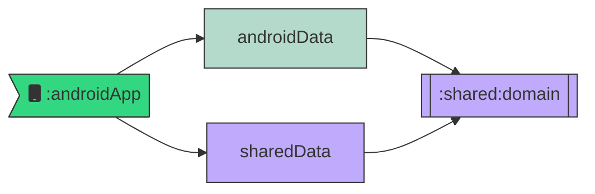

# Goat Multiplatform

Sample app for Android Makers by droidcon 2024 talk (x@enthuan and @bapness)

## How to use it

In `OmgApplication.kt`, you can switch between Android data module to KMP data module.

The dependency injection will do the job under the hood.

Of course, `domain` layer should be in KMP so that `sharedData` can access to it.

## Endpoints

2 endpoints are avaiable through GitHub Pages.