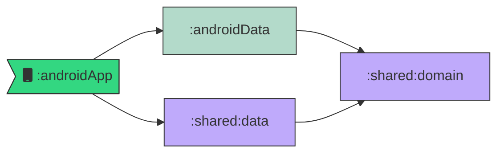

# Goat Multiplatform

**Contributors:** [@enthuan](https://github.com/enthuan), [@bapness](https://github.com/bapness)

It's a sample app for our *Android Makers by droidcon 2024* talk.<br>
The goal is to show how to switch part of the codebase from Android to KMP.

## How to use it

In `OmgApplication.kt`, you can switch between Android data module to KMP data module.

The dependency injection will do the job under the hood.

Of course, **domain layer** should be in KMP so that **shared data** can access to it.

```kotlin
class OmgApplication : Application() {
    override fun onCreate() {
        super.onCreate()
        val useSharedData = true
        with(this) {
            startKoin(useSharedData)
        }
    }
}
```

## Gradle modules graph




Both `:androidData` and `:shared:data` offer data layer to the app but they don't use the same librairies under the hood.
- `:androidData` is an Android library only.
- `:shared:data` is (kind of) compatible for iOS also sur [KMP framework](https://kotlinlang.org/docs/multiplatform.html).

## Endpoints

2 endpoints are avaiable through GitHub Pages:

- **Teaser**, retrieve all goat data ready for a light list view: [fakeApi/goat/all.json](https://bapness.github.io/goat-multiplatform/fakeApi/goat/all.json)
- **Details** (from 1 to 20), replace "ID" by the number to retrieve a goat detail data: [fakeApi/goat/ID/details.json](https://bapness.github.io/goat-multiplatform/fakeApi/goat/5/details.json)